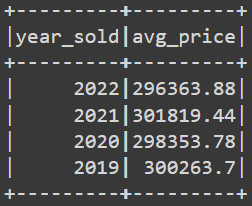
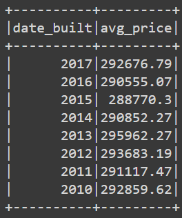
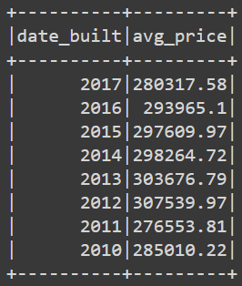
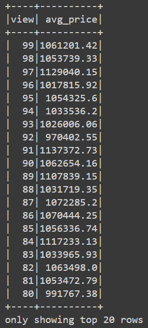

# Home_Sales

## Instructions

Upload `Home_sales.ipynb` to Google Colab to run code

## Overview

Determine key metrics about home sales data using SparkSQL. Spark is used to create temporary views, partition the data, cache and uncache a temporary table.

## Results

1. The average price for a four-bedroom house sold for each year  
  

2. The average price of a home for each year the home was built, that has three bedrooms and three bathrooms?  
  

3. The average price of a home for each year the home was built, that has three bedrooms, three bathrooms, two floors, and is greater than or equal to 2,000 square feet?  
  

4. The average price of a home per "view" rating having an average home price greater than or equal to $350,000?  
  

**Run time for query #4**  
Uncached: 1.1359009742736816 seconds  
Cached: 0.6821291446685791 seconds  
Partitioned: 0.952150821685791 seconds

The cached dataset ran the fastest for this query. However, partitioned data may result in a faster run time for a larger dataset or more complex query.

## References

Data for this dataset was generated by edX Boot Camps LLC, and is intended for educational purposes only.
